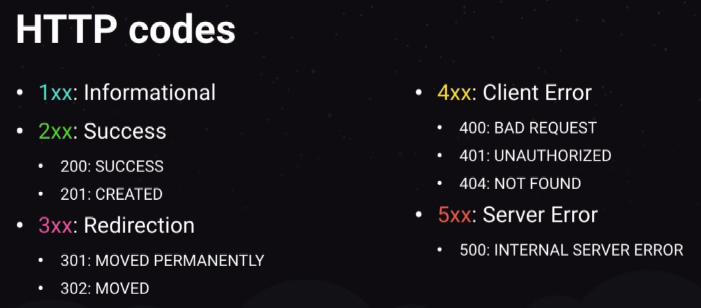

# NodeJS

## Características

- Javascript no backend
- Rotas e integrações
- Construído sobre a engine V8 do Google Chrome

## NPM e YARN

- Instalar libs de terceiros
- Fornecer bibliotecas
- **Yarn over NPM**? => Sim!! mais rápido e mais evoluído

## Características

- Baseado em eventos
- Call Stack
- Arquitetura event loop
- **Single thread**
- **Background threads**
- Non blocking I/O
- LIFO

## Frameworks

- ExpressJS
  - mais simples
  - Micro-serviços
  - Sem opinião
- Frameworks opinados
  - AdonisJS
  - NestJS

## API REST

- Fluxo de requisição e resposta
- Benefícios
  - Múltiplos clientes utilizando a mesma API
  - Protocole de comunicação padronizado - Mesma estrutura para Web e Mobile - Comunicação com serviços externos
    -Exemplo de requisição REST


- Códigos HTTP
  

## Primeira API

a) Inicializar o projeto:
`yarn init -y`

b) Adicionar o Express:
`yarn add express`

c) Crie o entrypoint da API

    - novo arquivo: `index.js`

- ```javascript
  const express = require("express");

  const server = express();

  server.get("/teste", () => {
    console.log("chamei");
  });

  server.listen(3000);
  ```

  - Query params

    - Para receber os parâmetros que são enviados na URL, usamos:

    ```javascript
    //localhost:3000/teste?name=Willian
    http: const { name } = req.query;
    res.status(200).json({ msg: `Howdy ${name}` });
    ```

  - Route Params
    - Para pegar os parâmetros via rota:

  ```js
  // route params
  const { id } = req.params;
  res.status(200).json({ id });
  ```

- Instalando o Nodemon

  - `yarn add nodemon -D`

  - -D é a flag para dependência de desenvolvimento
  - configurando o nodemon

    `"scripts": { "dev": "nodemon index.js" },`

- Fazendo o Express entender JSON
  `server.use(express.json());`

## CRUD SIMPLES

```javascript
let users = [];

//retorna os users
server.get("/users/all", (req, res) => {
  return res.status(200).json(users);
});
server.post("/users/new", (req, res) => {
  const { name } = req.body;
  if (name !== null && name !== undefined) {
    users.push(name);
    return res
      .status(200)
      .json({ msg: `User ${name} adicionado com sucesso  ` });
  } else {
    return res.status(400).json({ msg: "Erro ao fazer parse do usuário" });
  }
});
server.put("/users/update/:index", (req, res) => {
  const { index } = req.params;
  const { newName } = req.body;
  try {
    if (users[index] !== null && users[index] !== undefined) {
      users[index] = newName;
      return res.status(200).json({ msg: "User alterado com sucesso" });
    } else {
      return res.status(400).json({ msg: "Index não encontrado" });
    }
  } catch (error) {}
});
server.delete("/users/delete/:index", (req, res) => {
  if (toDelete !== null && toDelete !== undefined) {
    users = users.filter(user => user !== toDelete);
    return res.status(200).json({ users });
  } else {
    return res.status(400).json({ msg: "Erro ao deletar user selecionado" });
  }
});
```

## Middlewares

- São utilizados para tratarem eventos no NodeJS
- Definindo um middleware:

  ```javascript
  function checkUserExists(req, res, next) {
    if (!req.body.name) {
      return res.status(400).json({ msg: "Falta enviar o usuário" });
    }
    next();
  }
  ```

- Posso executar diversos tratamentos dentro de um middleware que minha requisição esperará pelo `next()` ser chamado.
- Invocando um middleware:

  ```javascript
  //middleware check
  server.post("/users/new", checkUserExists, (req, res) => {
    const { name } = req.body;
    if (name !== null && name !== undefined) {
      users.push(name);
      return res
        .status(200)
        .json({ msg: `User ${name} adicionado com sucesso  ` });
    } else {
      return res.status(400).json({ msg: "Erro ao fazer parse do usuário" });
    }
  });
  ```

- as
