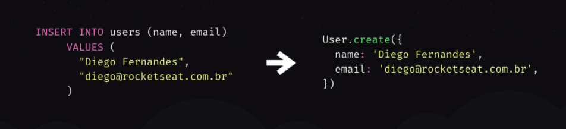
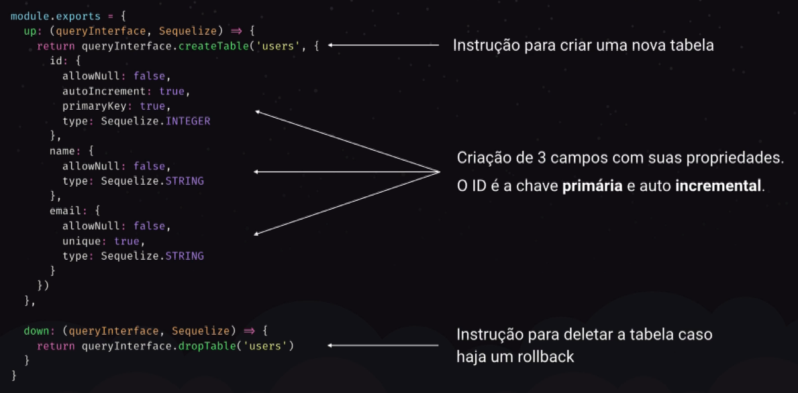
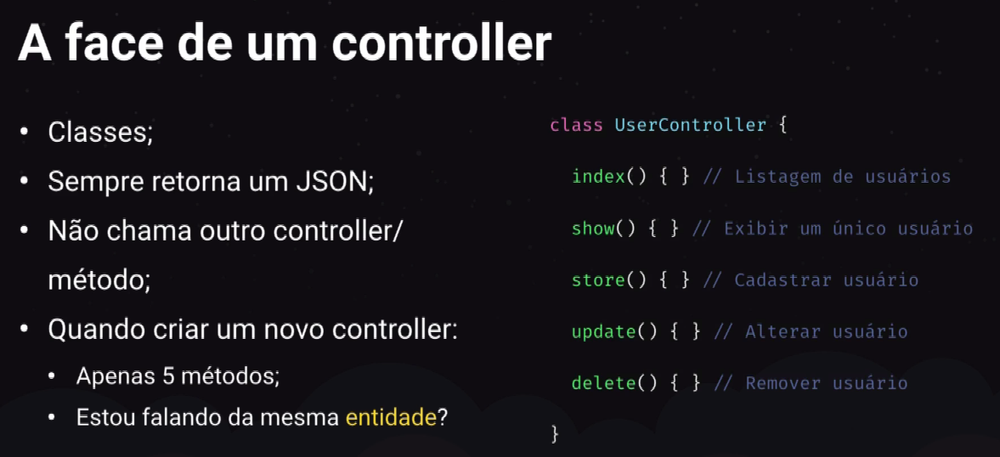
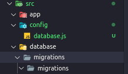

# Módulo 02 - API do GoBarber

## Fazendo o NodeJS entender import

- Passo 1

  - Instalar o sucrase
    `yarn add sucrase`

- Passo 2

```javascript
  {
  //criar arquivo nodemon.js
  "execMap": {
    "js": "sucrase-node"
  }
}


```

## ORM

- Abstração do banco de dados
- Tabelas viram models
- Permitem a manipulação de dados usando apenas código Javascript
  

## Migrations

- Controle de versões para bases de dados
- Cada migration contem instruções para criação, alteração ou remoção de tabelas ou colunas
- Mantém a base de dados atualizada entre todos os devs e ambiente de produção
  

## Seeds

- População da base de dados para desenvolvimento e testes
- Não são usados em produção

## Arquitetura MVC

- Model
  - Armazena a abstração do banco. Não possuem responsabilidade sobre a regra de negócio.
- View
  - Retorno ao cliente - JSON nas APIs ou HTML.
- Controller

  - Ponto de entrada das requisições da aplicação. Uma rota geralmente está associada a um método do controller. Onde as regras de negócio ficam.

- 

## ESLint

- Instalar:
  `yarn add eslint -D`
- Inicializar
  `yarn eslint --init`
- Prettier
  `yarn add prettier eslint-config-prettier eslint-plugin-prettier -D`
- Config ESLint

  ```javascript
  // arquivo .eslintrc.js
  module.exports = {
    env: {
      es6: true,
      node: true,
    },
    extends: ['airbnb-base', 'prettier'],
    plugins: ['prettier'],
    globals: {
      Atomics: 'readonly',
      SharedArrayBuffer: 'readonly',
    },
    parserOptions: {
      ecmaVersion: 2018,
      sourceType: 'module',
    },
    rules: {
      'prettier/prettier': 'error',
      'class-methods-use-this': 'off',
      'no-param-reassign': 'off',
      'no-unused-vars': ['error', { argsIgnorePattern: 'next' }],
    },
  };
  ```

## Sequelize

- Instalar
  `yarn add sequelize`
  `yarn add sequelize-cli -D`

  - Arquivos a serem criados

    ```javascript
    // .sequelizerc
    const { resolve } = require('path');

    module.exports = {
      config: resolve(__dirname, 'src', 'config', 'database.js'),
      'models-path': resolve(__dirname, 'src', 'app', 'models'),
      'migrations-path': resolve(__dirname, 'src', 'database', 'migrations'),
      'seeders-path': resolve(__dirname, 'src', 'database', 'seeds'),
    };
    ```

- Definindo a database

  ```javascript
  //arquivo /config/database.js
  module.exports = {
    dialect: 'postgres',
    host: 'localhost',
    username: 'postgres',
    password: 'docker',
    database: 'gobarber',
    define: {
      timestamps: true,
      undescored: true,
      underscoredAll: true,
    },
  };
  ```

  - Estrutura de pastas requerida
    

## Misc

- Ver logs no docker
  `docker logs nomedaimagem`
