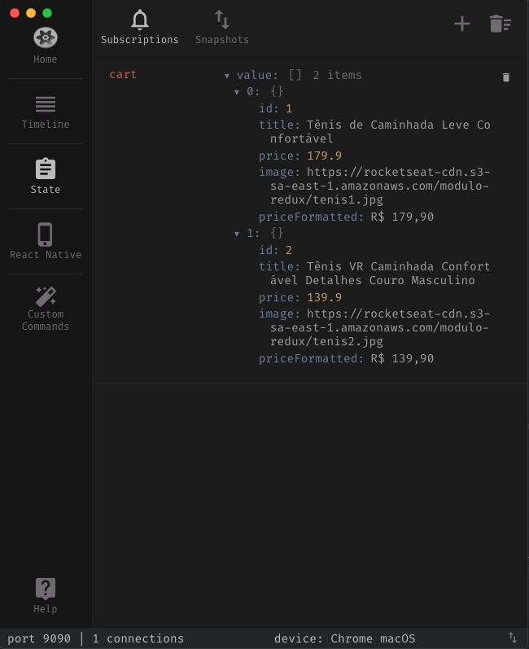

# Arquitetura Flux


**A store**

"store" é o nome dado pelo Facebook para o conjunto de estados da sua aplicação. Vamos pensar na store como um grande centro de informações, que possui disponibilidade para receber e entregar exatamente o que o seu componente requisita (seja uma função, ou uma informação propriamente dita). Tecnicamente, a store é um **objeto JavaScript** que possui **todos os estados** dos seus componentes.

**Os reducers**

Cada dado da store deve ter o seu próprio reducer, por exemplo: o dado "user" teria o seu reducer, chamado "userReducer". Um reducer é **encarregado de lidar com todas as ações**, como algum componente pedindo para alterar algum dado da store.

**As actions**

Actions são responsáveis por requisitar algo para um reducer. Elas devem ser sempre funções puras, o que, dizendo de uma forma leiga, quer dizer que elas devem **APENAS** enviar os dados ao reducer, nada além disso.

```javascript
    {
      type: "ADD_TO_CART",
      product: {...}
    }
```

- Toda ACTION deve ter um TYPE!

- Reducers intermedeiam a alteração de estado.
- **PRINCÍPIOS**
  - O estado do Redux é o único ponto de verdade
  - O estado do Redux **NÃO** pode ser mutado sem Action
  - As **ACTIONS** e os **REDUCERS** são funções PURAS, sendo assim não lidam com side-effects assíncronos
    - **NÃO** FAZEM CHAMADAS A APIs
    - **NÃO** PERSISTEM EM BANCO DE DADOS
    - Mas o que é uma FUNÇÃO PURA :question:
      - Função que independente da quantidade de chamadas, com os mesmos parâmetros, **SEMPRE** serão obtidos os mesmos resultados
  - Qualquer lógica assíncrona para regras de negócio deve ficar no REDUCER e nunca na ACTION
    - REDUCER :white_check_mark:
    - ACTION :x:
  * Nem toda aplicação necessita de Redux, inicie sem ele e se sentir necessidade, adicione!

## O que é Redux?

- Biblioteca que implementa a arquitetura Flux

## Quando usar?

- Meu estado tem mais de um dono
- Estado é manipulado por vários componentes
- Ações do usuário causam efeitos colaterais nos dados

## Exemplos de uso

- Carrinhos de compras :shopping_cart:
- Player de música :musical_note:

  

# Iniciando o Rocketshoes

## Rotas

- `yarn add react-router-dom` - Lidar com as rotas da aplicação
- Configurando o arquivo `routes.js`

```javascript
import React from 'react';
import { Switch, Route } from 'react-router-dom';
/*Switch permite somente a escolha de UMA ROTA*/
import Home from './pages/Home';
import Cart from './pages/Cart';
export default function Routes() {
  return (
    <Switch>
      <Route path="/" exact component={Home} />
      <Route path="/cart" component={Cart} />
    </Switch>
  );
}
```

- Importando no `App.js`

```javascript
import React from 'react';
import { BrowserRouter } from 'react-router-dom';
import Routes from './routes';

function App() {
  return (
    <BrowserRouter>
      <Routes />
    </BrowserRouter>
  );
}

export default App;
```

## Estilos Globais

- Instale o `styled-components`
- Crie uma pasta `styles` na raiz da pasta `src` com um arquivo `global.js`
- Conteúdo do arquivo `global.js`

```javascript
import { createGlobalStyle } from 'styled-components';
export default createGlobalStyle`
  * {
    margin: 0;
    padding: 0;
    outline: 0;
    box-sizing: border-box;
    }
    body {
      background: #191919;
      -webkit-font-smoothing: antialiased !important;
    }
    body, input, button {
      font: 14px sans-serif;
    }
    #root {
      max-width: 1020px;
      margin: 0 auto;
      padding: 0 20px 50px;
    }
    button {
      cursor: pointer;
    }
`;
```

- Adicionando fonte a partir de `@import url`

```javascript
import { createGlobalStyle } from 'styled-components';
export default createGlobalStyle`
  @import url('https://fonts.googleapis.com/css?family=Roboto&display=swap');
    * {
      margin: 0;
      padding: 0;
      outline: 0;
      box-sizing: border-box;


      }
      body {
        background: #191919;
        -webkit-font-smoothing: antialiased !important;

      }
      body, input, button {
        font: 14px, Roboto  sans-serif;

      }
      #root {
        max-width: 1020px;
        margin: 0 auto;
        padding: 0 20px 50px;
      }
      button {
        cursor: pointer;
      }
  `;
```

- Adicionando SVG a partir de arquivo

```javascript
import { createGlobalStyle } from 'styled-components';
import background from '../../assets/back.svg';

export default createGlobalStyle`
  ...
    body {
      background: #191919 url(${background}) no-repeat center top;
      -webkit-font-smoothing: antialiased !important;

    }
  ...
`;
```

- Invocando os estilos globais no arquivo `App.js`

```javascript
...
import GlobalStyle from './styles/global';

function App() {
  return (
    <BrowserRouter>
      {/* <Header/> */}
      <GlobalStyle />
      <Routes />
    </BrowserRouter>
  );
}

export default App;
```

## Header

- Crie um novo componente chamado Header e importe antes das Rotas do `App.js`

```javascript
import React from 'react';
import { Link } from 'react-router-dom';
import { MdShoppingBasket } from 'react-icons/md';
import logo from '../../assets/logo.svg';
import { Container, Cart } from './styles';

export default function Header() {
  return (
    <Container>
      <Link to="/">
        
      </Link>
      <Cart to="/cart">
        <div>
          <strong>Meu carrinho</strong>
          <span>3 itens</span>
        </div>
        <MdShoppingBasket size={34} color="#fff" />
      </Cart>
    </Container>
  );
}
```

- Customização

```javascript
import styled from 'styled-components';
import { Link } from 'react-router-dom';

export const Container = styled.header`
  display: flex;
  justify-content: space-between;
  align-items: center;
  margin: 50px 0;
`;
export const Cart = styled(Link)`
  display: flex;
  align-items: center;
  text-decoration: none;
  transition: opacity 0.2s;
  &:hover {
    opacity: 0.7;
  }
  div {
    text-align: right;
    margin-right: 10px;
    strong {
      display: block;
      color: #fff;
    }
    span {
      font-size: 12px;
      color: #999;
    }
  }
`;
```

## Estilização da Home

- Crie um `styles.js`

```javascript
import styled from 'styled-components';
import { darken } from 'polished';

export const Container = styled.div`
  padding: 30px;
  background: #fff;
  border-radius: 4px;
  footer {
    margin-top: 30px;
    display: flex;
    justify-content: space-between;
    align-items: center;

    button {
      background: #7159c1;
      color: #fff;
      border: 0;
      border-radius: 4px;
      padding: 12px 20px;
      font-weight: bold;
      text-transform: uppercase;
      transition: background 0.2s;
      &:hover {
        background: ${darken(0.03, '#7159c1')};
      }
    }
  }
`;
export const ProductTable = styled.table`
  width: 100%;
  thead th {
    color: #999;
    text-align: left;
    padding: 12px;
  }
  tbody td {
    padding: 12px;
    border-bottom: 1px solid #eee;
  }
  img {
    height: 100px;
  }
  strong {
    color: #333;
    display: block;
  }
  span {
    display: block;
    margin-top: 5px;
    font-size: 18px;
    font-weight: bold;
  }
  div {
    display: flex;
    align-items: center;
    input {
      border: 1px solid #ddd;
      border-radius: 4px;
      color: #666;
      padding: 6px;
      width: 50px;
    }
  }
  button {
    background: none;
    border: 0;
    padding: 6px;
  }
`;
export const Total = styled.div`
  display: flex;
  align-items: baseline;
  span {
    color: #999;
    font-weight: bold;
  }
  strong {
    font-size: 28px;
    margin-left: 5px;
  }
`;
```

- Estruture o componente da seguinte forma

```javascript
import React from 'react';
import {
  MdRemoveCircleOutline,
  MdAddCircleOutline,
  MdDelete,
} from 'react-icons/md';
import { Container, ProductTable, Total } from './styles';

export default function Cart() {
  return (
    <Container>
      <ProductTable>
        <thead>
          <tr>
            <th />
            <th>PRODUTO</th>
            <th>QTD</th>
            <th>SUBTOTAL</th>
            <th />
          </tr>
        </thead>
        <tbody>
          <tr>
            <td>
              
            </td>
            <td>
              <strong>Tenis sghow</strong>
              <span>R$ 129,90</span>
            </td>
            <td>
              <div>
                <button type="button">
                  <MdAddCircleOutline size={20} color="#7159c1" />
                </button>
                <input type="number" readOnly value={2} />
                <button type="button">
                  <MdRemoveCircleOutline size={20} color="#7159c1" />
                </button>
              </div>
            </td>
            <td>
              <strong>R$ 258,80 </strong>
            </td>
            <td>
              <button type="button">
                <MdDelete size={20} color="#7159c1" />
              </button>
            </td>
          </tr>
        </tbody>
      </ProductTable>
      <footer>
        <button type="button">Finalizar pedido</button>
        <Total>
          <span>Total</span>
          <strong>R$ 1920</strong>
        </Total>
      </footer>
    </Container>
  );
}
```

## JSON Server

- Permite executar uma API mockada a partir de dados constantes em um JSON previamente preparado.
- Instalação
  - Instale a dependência `json-server`
  - Crie um arquivo chamado `abc.json`
  - Rode a API através do comando `json-server --watch abc.json`
    - Temos o problema da porta 3000 já ser usada pelo ReactJS, então como procedemos :question:
  - Rode a API através do comando `json-server abc.json -p 3333 -w`
    - `-p` é relativo a porta e `-w` é para o server sempre observar o JSON por mudanças
  - Sua API estará disponível no `localhost:3000`
- Consumindo a API
  - Crie uma pasta `service` e defina o arquivo `api` e consuma o arquivo

## Internacionalização

- Serve para configurar objetos com formatações específicas relativas à países.
- Arquivo `format.js` na pasta `util`

```javascript
/*exportarei a função format como formatPrice*/
export const { format: formatPrice } = new Intl.NumberFormat('pt-BR', {
  style: 'currency',
  currency: 'BRL',
});
```

## Redux

- Instalando:
  - `yarn add redux react-redux`
- Configurando

  - Crie uma pasta `store` na `src` com um arquivo `index.js` dentro:
    ```javascript
    import { createStore } from 'redux';
    const store = createStore();
    export default store;
    ```
  - Importe no arquivo `App.js` da seguinte forma
    `import {Provider} from 'react-redux'` - o Provider é responsável por disponibilizar uma `store` para todo o App.
  - Wrap os itens do return do `App.js` com o componente Provider

  ```javascript
  import React from 'react';
  import { BrowserRouter } from 'react-router-dom';
  import { Provider } from 'react-redux';
  import GlobalStyle from './styles/global';
  import Routes from './routes';
  import Header from './components/Header';

  // redux
  import store from './store/index';

  function App() {
    return (
      <Provider store={store}>
        <BrowserRouter>
          <Header />
          <GlobalStyle />
          <Routes />
        </BrowserRouter>
      </Provider>
    );
  }

  export default App;
  ```

  - App vai crashar! Porquê? Porque não podemos criar `stores` sem `reducers`

  ```javascript
  import { createStore } from 'redux';=
  function cart() {
    return [];
  }
  // cart pode ser um reducer
  const store = createStore(cart);
  export default store;

  ```

  - Componentizando os reducers

    - Crie uma pasta `modules` em `store` e dentro dela uma pasta que reflita o seu `reducer`: `cart` no caso atual e dentro dessa pasta, crie um arquivo `reducer.js`
    - O conteúdo desse arquivo deve ser primariamente o seguinte:

    ```javascript
    export default function cart() {
      return [];
    }
    ```

  - Pra um só reducer, isso funciona OK! E para vários?

    - Para tratar vários reducers, devemos utilizar um consolidador, que aqui chamaremos de `rootReducer`. Esse arquivo deve ficar dentro da pasta `modules` dentro de `store`.

    ```javascript
    import { combineReducers } from 'redux';
    import cart from './cart/reducer';

    export default combineReducers({
      cart,
      // outros reducers
    });
    ```

    - Feita essa consolidação, no arquivo `index.js` da pasta `store`, importe o `rootReducer` e passe para a função `createStore`

    ```javascript
    import { createStore } from 'redux';
    import rootReducer from './modules/rootReducer';
    const store = createStore(rootReducer);
    export default store;
    ```

  - Conectando componentes e estados
    - Importe o função `connect` do `react-redux` no componente alvo
    - No fim do arquivo, faça com que o componente use `export default connect()(NomeDoComponente)` -> assegure-se de remover o `export default` da instanciação do componente
    - O connect pode receber parâmetros => uma função.
  - Despachando as actions - Defina uma função que enviará as mudanças de estado para a `store` (no `onClick`, `onSubmit`).

    `<button onClick={this.handleAddProduct}>`

    e posteriormente, na função, dispare a action relativa aquela função:

    ```javascript
    handleAddProduct = product => {
      /**
       * qualquer componente que importa connect, tem uma nova prop chamada dispatch.
       * E o que fazemos com o dispatch? Disparamos ACTIONS
       *  */
      const { dispatch } = this.props;
      dispatch({
        type: 'ADD_TO_CART',
        product,
      });
    };
    ```

    - Tenha em mente que esse `dispatch` direcionará para o reducer.
    - TODA vez que um `dispatch` é disparado, TODOS os `reducers` escutam! Mas então, como saberemos que `reducer` tratará a nossa requisição?? **SIMPLES**!!!! Pela ACTION! :wink:
    - Beleza então! Mas como temos acesso à Action? No construtor da função temos acesso a dois parâmetros padrão: o estado anterior da aplicação (`state`) e a action (`action`)

      ```javascript
      export default function cart(state, action) {
        // a action contém o que foi enviado no dispatch do componente
        /*
          {
            type: 'ADD_TO_CART',
            product,
          }
        */
        return [];
      }
      ```

      - Estrutura padrão de um `reducer`

      ```javascript
      export default function cart(state = [], action) {
        switch (action.type) {
          case 'ADD_TO_CART':
            return [...state, action.product];
          default:
            return state;
        }
      }
      ```

    - Acessando dados do state em outros componentes

      - Faça o esquema de exportação de componentes com o `connect` - neste exemplos faremos no `Header`
      - Dentro do `connect` utilizaremos uma função para obter os dados do state

      ```javascript
      // state => parâmetro o qual a função connect tem acesso
      export default connect(state => ({
        // cart: parâmetro a ser desestrurado no construtor do Componente atual do arquivo - linha 607
        cart: state.cart,
        //state.cart => nome do reducer que quero acessar
      }))(Header);
      ```

      ```javascript
      function Header({ cart }) {
        console.log(cart);
        return (
          <Container>
            <Link to="/">
              
            </Link>
            <Cart to="/cart">
              <div>
                <strong>Meu carrinho</strong>
                <span>{cart.length}</span>
              </div>
              <MdShoppingBasket size={34} color="#fff" />
            </Cart>
          </Container>
        );
      }
      ```

    - Toda vez que os dados do state mudarem, o componente será renderizado.

## Redux e Reactotron

- Instalando as dependências
  `yarn add reactotron-react-js reactotron-redux`
- Configurando o Reactotron: crie uma pasta `config` com um arquivo `ReactotronConfig.js` com o seguinte conteúdo

```javascript
import Reactotron from 'reactotron-react-js';
import { reactotronRedux } from 'reactotron-redux';

if (process.env.NODE_ENV === 'development') {
  const tron = Reactotron.configure()
    .use(reactotronRedux())
    .connect();

  tron.clear();

  console.tron = tron;
}
```

- Configurando na `index.js` da `store`

```javascript
import { createStore } from 'redux';
import rootReducer from './modules/rootReducer';
const enhancer =
  process.env.NODE_ENV === 'development' ? console.tron.createEnhancer() : null;
const store = createStore(rootReducer, enhancer);
export default store;
```

- Agora é só importar a configuração do Reactortron do `App.js`
  `import './config/ReactotronConfig';`
- Regra no `eslintrc.js` para remover os erros dos `console.tron`
  `'no-console': ['error', { allow: ['tron'] }],`

**Reactotron**





## Listando os produtos no carrinho

- Importe o `connect` do `react-redux` e dê `export default connect()(Cart)`
- Em vez de lidarmos com o `cart` dentro do construtor do `connect`, podemos criar uma função que lida com o estado e passamos essa função para o `connect`

```javascript
//essa função é um _snippet_ da Rocketseat
// converte reducers em propriedades do componente
const mapStateToProps = state => ({
  cart: state.cart,
});
export default connect(mapStateToProps)(Cart);
```

- A partir desse momento, já podemos desestruturar/obter as informações do carrinho no nosso componente de função.
  `function Cart({cart})`

## Adicionando novas informações ao add no carrinho.

- Mock de amount quando o mesmo é adicionado

```javascript
export default function cart(state = [], action) {
  switch (action.type) {
    case 'ADD_TO_CART':
      return [
        ...state,
        {
          ...action.product,
          amount: 1,
        },
      ];
    default:
      return state;
  }
}
```

## Validando produto duplicado.

- Quando adicionamos um produto que já tem um exemplar no carrinho, o comportamento até agora é criar um novo produto na listagem. Não seria melhor que somente incrementasse a quantidade do produto já existente? SIM.
  ### Como fazemos isso:question:
  - Primeiro vamos adicionar o `immer`! Mas o que é `immer`? De comer ou passar no cabelo?
    O `immer` é uma biblioteca que nos ajuda a lidar com estados imutáveis. Ela consegue isso nos fornecendo um estado `draft` que é o meio termo entre o estado ATUAL da aplicação e o estado FINAL (com nossas modificações implementadas).
  - O `immer` conta com a função produce que tem como objetivo lidar com essas duas fases do estado (draft e state)
  ```javascript
  import { produce } from 'immer';
  export default function cart(state = [], action) {
    switch (action.type) {
      case 'ADD_TO_CART':
        return produce(state, draft => {
          /**
           * procura ai no array dos products que estão no draft/estado atual, se tem um product com id igual
           * a esse do action.product que estou mandando
           */
          const productIndex = draft.findIndex(p => p.id === action.product.id);
          // se tiver, nos temos que aumentar a quantidade dele em +1, pois é essa a ação do cliente
          if (productIndex >= 0) {
            draft[productIndex].amount += 1;
            // se não, faz o spread do produto e adiciona a propriedade amount: 1 pois é o primeiro
          } else {
            draft.push({
              ...action.product,
              amount: 1,
            });
          }
        });
      default:
        return state;
    }
  }
  ```
- Tirando o erro do draft no reducer do cart
  `'no-param-reassign': 'off'`

## Removendo o produto do carrinho

- Faça o `onClick` do botão de delete despachar uma action para remoção

```javascript
  onClick={() =>
    dispatch({
      type: 'REMOVE_FROM_CART',
      id: product.id,
    })
  }
```

- Intercepte essa ACTION no reducer do carrinho

```javascript
  case 'REMOVE_FROM_CART':
    return produce(state, draft => {
      // o id que eu passo diretamente pela action
      const productIndex = draft.findIndex(p => p.id === action.id);
      if (productIndex >= 0) {
        // fatia esse array ai na posição x do meu id e remove uma posição
        draft.splice(productIndex, 1);
      }
    });

```

## Refatorando as actions

- Dentro da pasta `/store/modules/cart` crie um arquivo de nome `actions.js`

```javascript
export function addToCart(product) {
  return {
    type: 'ADD_TO_CART',
    product,
  };
}
export function removeFromCart(id) {
  return {
    type: 'REMOVE_FROM_CART',
    id,
  };
}
```

- Invocando as actions
  - Importe as actions onde as mesmas são necessárias, da seguinte forma
    `import * as CartActions from '../../store/module/cart/actions'`
  - Invoque as mesmas da seguinte forma:
    `dispatch(CartActions.addToCart(product))`
- Facilitando ainda mais com o `bindActionCreators`

  - Usando-se da função `mapDispatchToProps` eu posso converter actions em props de um componente

  ```javascript
    import {bindActionCreators} from 'redux'
    ...
    const mapDispatchToProps = dispatch =>
      bindActionCreators(CartActions, dispatch);
      //no lugar do null poderia estar o nosso mapStateToProps
    export default connect(null, mapDispatchToProps)(Home)
  ```

  - Fazendo isso, podemos invocar as actions do reducer da seguinte maneira:

    ```javascript
    const { addToCart } = this.props;
    addToCart(product);
    // porque eu não preciso dar o dispatch aqui?? SIMPLES!!! O DISPATCH já vai na função mapDispatchToProps
    ```

    sem precisar invocar a CartAction na frente. As actions se tornaram props do nosso componente.

  - Fazendo o mapDispatchToProps funcionar no componente Cart Pulo do :cat:
    `function Cart({ cart, removeFromCart })` - verificar porque aqui.

- Como saber qual componente está disparando as actions?

  - Simples, só anotar o nome do componente na action despachada:

  ```javascript
  export function addToCart(product) {
    return {
      type: '@cart/ADD',
      product,
    };
  }
  export function removeFromCart(id) {
    return {
      type: '@cart/REMOVE',
      id,
    };
  }
  ```

  - **NÃO SE ESQUEÇA DE ALTERAR O REDUCER PARA OUVIR ESSAS AÇÕES**

  ```javascrip
    case '@cart/ADD':
    case '@cart/REMOVE':

  ```

## Mudando a quantidade de itens no carrinho

- Estruture as actions e dispatchs normalmente, só que a função de incrementar não será realizada pelo reducer.
  Para executá-las usaremos 2 funções no próprio componente, com o seguinte corpo:

```javascript
function increment(product) {
  updateAmount(product.id, product.amount + 1);
}
function decrement(product) {
  updateAmount(product.id, product.amount - 1);
}
```

- reducer

```javascript
    case '@cart/UPDATE_AMOUNT': {
      //não deixa baixar de 1 a quantidade - se quiser, remova
      if (action.amount <= 0) {
        return state;
      }
      return produce(state, draft => {
        const productIndex = draft.findIndex(p => p.id === action.id);
        if (productIndex >= 0) {
          draft[productIndex].amount = Number(action.amount);
        }
      });
    }

```

## Calculando totais

- O melhor lugar para fazer a operação de cálculo de valor de carrinho é no mapStateToProps

```javascript
const mapStateToProps = state => ({
  cart: state.cart.map(product => ({
    ...product,
    // o subtotal é relativo ao item * quantidade
    subtotal: formatPrice(product.price * product.amount),
  })),
  // essa variável eu consigo obter via desestruturação lá no constructor
  // o total é relativo a soma dos itens no carrinho
  total: state.cart.reduce((total, product) => {
    return total + product.price * product.amount;
  }, 0),
});
```

## Mostrando as quantidade de itens que estão no carrinho no botão Adicionar

```javascript
//recebendo
const { amount } = this.props;
//usando
<div>
  <MdAddShoppingCart size={16} color="#fff" />
  {amount[product.id] || 0}
</div>;

//definindo
const mapStateToProps = state => ({
  amount: state.cart.reduce((amount, product) => {
    amount[product.id] = product.amount;
    return amount;
  }, {}),
});
```

## Redux Saga

- Interceptador - middleware - no Redux
- Cria side-effects

- Instalação
  `yarn add redux-saga`
- Utilização

  - Crie um arquivo `sagas.js` dentro do seu module alvo

  ```javascript
  // responsável por chamar métodos assincronos e que retornam promises // put-> disparar actions
  import { call, put, all, takeLatest } from 'redux-saga/effects';
  import api from '../../../services/api';
  import { addToCartSuccess } from './actions';
  // quase um async
  function* addToCart({ id }) {
    //chamada a API
    const response = yield call(api.get, `/products/${id}`);
    //disparar a action
    yield put(addToCartSuccess(response.data));
  }
  export default all([
    // pegue só a ultima chamada
    takeLatest('@cart/ADD_REQUEST', addToCart),
  ]);
  ```

  - Preste atenção que as invocações mudam

```javascript
// ouvida pelo saga -> OK - dispara a success pro reducer
export function addToCartRequest(id) {
  return {
    type: '@cart/ADD_REQUEST',
    id,
  };
}
export function addToCartSuccess(product) {
  return {
    type: '@cart/ADD_SUCCESS',
    product,
  };
}
```

- Nosso reducer só vai ouvir o sucesso. A request será interceptada pelo Saga

```javascript
switch (action.type) {
  case '@cart/ADD_SUCCESS':
    return produce(state, draft => {
      /**
       * procura ai no array dos products que estão no draft/estado atual, se tem um product com id igual
       * a esse do action.product que estou mandando
       */
      const productIndex = draft.findIndex(p => p.id === action.product.id);
      // se tiver, nos temos que aumentar a quantidade dele em +1, pois é essa a ação do cliente
      if (productIndex >= 0) {
        draft[productIndex].amount += 1;
        // se não, faz o spread do produto e adiciona a propriedade amount: 1 pois é o primeiro
      } else {
        draft.push({
          ...action.product,
          amount: 1,
        });
      }
    });
}
```

- Chamando no componente

```javascript
//addToCartRequest = oriundo das actions (recebe id)
const { addToCartRequest } = this.props;
addToCartRequest(product.id);

// o addToCartSucess recebe um produto todo
//file: sagas.js
  yield put(addToCartSuccess(response.data));

```

- Configurando no `enhancer`

```javascript
// compose -> unir configs
import { createStore, applyMiddleware, compose } from 'redux';
import createSagaMiddleware from 'redux-saga';
import rootReducer from './modules/rootReducer';
import rootSaga from './modules/rootSaga';

const sagaMiddleware = createSagaMiddleware();
const enhancer =
  process.env.NODE_ENV === 'development'
    ? compose(
        console.tron.createEnhancer(),
        applyMiddleware(sagaMiddleware)
      )
    : applyMiddleware(sagaMiddleware);
const store = createStore(rootReducer, enhancer);
sagaMiddleware.run(rootSaga);
export default store;
```

## Plugin do Redux Saga para o Reactotron

- Instalação
  `yarn add reactotron-redux-saga`
- Configuração

  - Edite o `ReactotronConfig.js` para a seguinte estrutura

  ```javascript
  import Reactotron from 'reactotron-react-js';
  import { reactotronRedux } from 'reactotron-redux';
  //add
  import reactotronSaga from 'reactotron-redux-saga';

  if (process.env.NODE_ENV === 'development') {
    const tron = Reactotron.configure()
      .use(reactotronRedux())
      //add
      .use(reactotronSaga())
      .connect();

    tron.clear();

    console.tron = tron;
  }
  ```

  -Altere o `index` da `store`

  ```javascript
  // compose -> unir configs
  import { createStore, applyMiddleware, compose } from 'redux';
  import createSagaMiddleware from 'redux-saga';
  import rootReducer from './modules/rootReducer';
  import rootSaga from './modules/rootSaga';
  //add
  const sagaMonitor =
    process.env.NODE_ENV === 'development'
      ? console.tron.createSagaMonitor()
      : null;
  //add new object sagaMonitor
  const sagaMiddleware = createSagaMiddleware({
    sagaMonitor,
  });
  const enhancer =
    process.env.NODE_ENV === 'development'
      ? compose(
          console.tron.createEnhancer(),
          applyMiddleware(sagaMiddleware)
        )
      : applyMiddleware(sagaMiddleware);
  const store = createStore(rootReducer, enhancer);
  sagaMiddleware.run(rootSaga);
  export default store;
  ```

## Consulta estoque do produto antes de add ao carrinho

- Para fazer essa consulta, nada melhor que utilizarmos o Redux Saga, pois sua ação de middleware nos permite ouvir actions prévias a alteração de estado `"ADD_REQUEST"` por exemplo.

```javascript
function* addToCart({ id }) {
  const productExists = yield select(state =>
    state.cart.find(p => p.id === id)
  );
  // vai na rota do estoque
  const stock = yield call(api.get, `/stock/${id}`);
  // pega o stock da loja
  const stockAmount = stock.data.amount;
  // se existir produto no cart, pega a quantidade
  const currentAmount = productExists ? productExists.amount : 0;
  //
  const amount = currentAmount + 1;
  if (amount > stockAmount) {
    console.tron.warn('Erro');
    return;
  }
  if (productExists) {
    yield put(updateAmount(id, amount));
  } else {
    const response = yield call(api.get, `/products/${id}`);
    const data = {
      ...response.data,
      amount: 1,
      priceFormatted: formatPrice(response.data.price),
    };
    yield put(addToCartSuccess(data));
  }
}
export default all([
  // pegue só a ultima chamada
  takeLatest('@cart/ADD_REQUEST', addToCart),
]);
```

## Mostrando alertas de erro na aplicação

- Instalação: `yarn add react-toastify`
- Importe o `ToastContainer` no `App.js` e insira dentro do `BrowserRouter`

```javascript
import React from 'react';
import { ToastContainer } from 'react-toastify';
function App() {
  return (
    <Provider store={store}>
      <BrowserRouter>
        <Header />
        <GlobalStyle />
        ->> <ToastContainer autoClose={3000} />
        <Routes />
      </BrowserRouter>
    </Provider>
  );
}
export default App;
```

- Importe os estilos do Toastify no `global.js`
  `import 'react-toastify/dist/ReactToastify.css';`
- Usando
  - Onde estiver seu erro, importe o `toast` do `react-toastify`
  - Exiba: `toast.error('mensagem')`

## Consulta ao estoque dentro do carrinho no + e -

- Faça como nas actions de add - duplique e crie uma `request` e uma `success`

```javascript
export function updateAmountRequest(id, amount) {
  return {
    type: '@cart/UPDATE_AMOUNT_REQUEST',
    id,
    amount,
  };
}
export function updateAmountSuccess(id, amount) {
  return {
    type: '@cart/UPDATE_AMOUNT_SUCCESS',
    id,
    amount,
  };
}
```

- Faça o Saga tratar as requisições:

```javascript
function* updateAmount({ id, amount }) {
  if (amount <= 0) return;
  const stock = yield call(api.get, `stock/${id}`);
  const stockAmount = stock.data.amount;
  if (amount > stockAmount) {
    toast.error('Quantidade solicitada não disponível no estoque');
    return;
  }
  yield put(updateAmountSuccess(id, amount));
}
export default all([
  // pegue só a ultima chamada
  takeLatest('@cart/ADD_REQUEST', addToCart),
  takeLatest('@cart/UPDATE_AMOUNT_REQUEST', updateAmount),
]);
```

## Navegação no Redux Saga

- Seria interessante que o usuário fosse redirecionado para o carrinho assim que clicasse no botão "ADICIONAR AO CARRINHO"
- Navegação, nesse caso, só através de Sagas
- Configuração:

  - Instale a dependência `history`
  - Crie um arquivo `history.js` na pasta `services`

  ```javascript
  import { createBrowserHistory } from 'history';=
  const history = createBrowserHistory();
  export default history;
  ```

  - Importe o `history` no `App.js`, troque o `BrowserRouter` por `Router` e passe o `history` como parâmetro.

  ```javascript
  function App() {
    return (
      <Provider store={store}>
        ->{' '}
        <Router history={history}>
          <Header />
          <GlobalStyle />
          <ToastContainer />
          <Routes />
        </Router>
      </Provider>
    );
  }

  export default App;
  ```

- Importe o `history` no sagas e quando o produto for adicionado no carrinho, faça o `history.push('/cart')`
- O legal de colocar isso no saga é que essa chamada só ocorrerá após a API finalizar a resposta;

## Resultado Final


