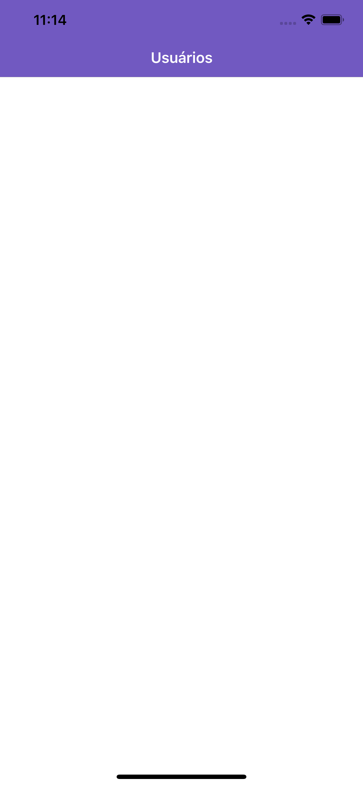

# Template de Aplicativo RN básico Rocketseat

## Tecnologias

- Babel
- Eslint
- EditorConfig
- Prettier
- Reactotron

## Executando

- Rode o comando `yarn` no terminal dentro da pasta do projeto.

## Anotações

- Sempre ao configurar o Reactotron, observar que o IP setado em `config/ReactotronConfig.js` pode ter mudado! Sempre atualize com o IP da sua máquina atual.

## React Navigation

- Siga sempre o guia da biblioteca: existem muitas configurações que variam
- `https://reactnavigation.org/docs/en/getting-started.html`
- Stack Navigation
  - Para navegação em pilha: pages sobrepõe as outras.
  - `yarn add react-navigation-stack`
- Rotas

  ```javascript
  import { createAppContainer } from 'react-navigation';
  import { createStackNavigator } from 'react-navigation-stack';
  import Main from './pages/Main';
  import User from './pages/User';

  const Routes = createAppContainer(
    createStackNavigator({
      Main,
      User,
    })
  );
  export default Routes;
  ```

## Configurando as opções de navegação

- Código

  ```javascript
  import { createAppContainer } from 'react-navigation';
  import { createStackNavigator } from 'react-navigation-stack';
  import Main from './pages/Main';
  import User from './pages/User';

  const Routes = createAppContainer(
    createStackNavigator(
      {
        Main,
        User,
      },
      {
        /*Alinhanndo ao centro*/
        headerLayoutPreset: 'center',
        /*Remove o leading text do botão voltar*/
        headerBackTitleVisible: false,
        defaultNavigationOptions: {
          headerStyle: {
            backgroundColor: '#7159c1',
          },
          /*Cor dos textos e botões*/
          headerTintColor: '#fff',
        },
      }
    )
  );
  export default Routes;
  ```

- Resultado
  
- Essa status bar com a cor preta nos ícones incomoda, não?
- Resolução

  ```javascript
  /*No index.js - importe StatusBar de React native - componente. Renderize */
  <StatusBar barStyle="light-content" backgroundColor="#7159c1" />
  ```

## Resultado Final


